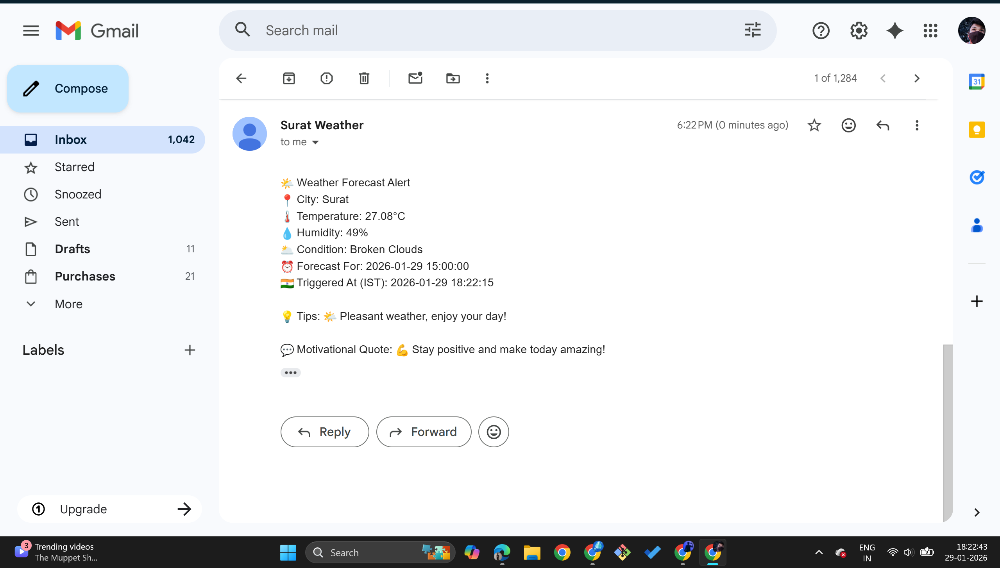
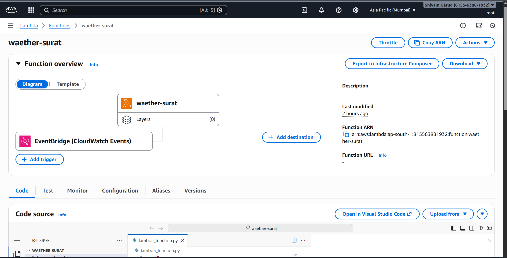
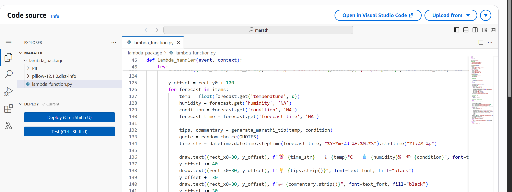
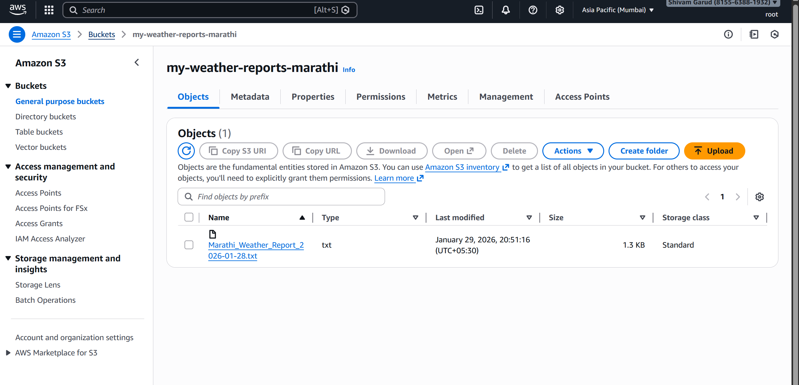
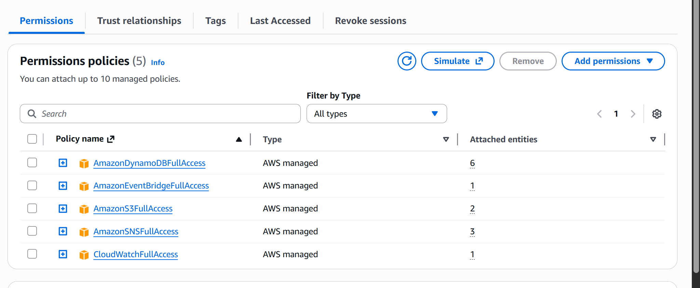

# 🌦️ SkyMonitor-Serverless-Weather-Alerts-S3-Report-Generator
  Serverless Weather Alert & Marathi Weather Report Generator

> ☁️ This project demonstrates a **fully automated serverless system** that monitors weather, sends alerts, generates Marathi weather reports, and creates report images — all **without managing any servers**.  
It uses **AWS Lambda, DynamoDB, SNS, S3**, and **Python** to automate weather notifications and daily report generation. 🚀  

---

## 🧰 Tech Stack & Tools

 

---

## 🌐 Live Project Demo

🔗 **S3 Bucket Reports:** `s3://my-weather-reports-marathi/`  
- Weather alerts sent via **SNS email**.  
- Daily Marathi reports available as `.txt` files.  
- Optional generated **weather report images** for sharing.  

---

## 🌤️ Project Overview

This system has **two main AWS Lambda functions**:

### **1️⃣ Hourly Weather Alert Lambda**
- Triggered **every hour**.
- Fetches live weather data from **OpenWeather API**.
- Sends weather alerts via **AWS SNS** (email/SMS) including:
  - 🌡 Temperature  
  - 💧 Humidity  
  - 🌥 Weather condition  
  - 💡 Tips & motivational quotes
- Stores all data in **DynamoDB**.
- Optional backup: stores daily weather text file.

### **2️⃣ Daily Marathi Report Generator Lambda**
- Triggered **daily at 8 AM** using **CloudWatch Event Rule**.
- Fetches **yesterday’s weather data** from DynamoDB.
- Generates **Marathi text weather report** with tips and commentary.
- Uploads report to **S3** (`Marathi_Weather_Report_YYYY-MM-DD.txt`).
- Optional: triggers **Python script** to generate a visually appealing **report image**.

---

## 🧩 Project Workflow Summary

| 🧱 Step | ⚙️ Description | 🧰 Tools/Technologies |
|:--------|:---------------|:--------------------|
| **1️⃣ Hourly Lambda Trigger** | Triggered every hour, fetches weather data from API. | AWS Lambda, CloudWatch Events |
| **2️⃣ Send Alerts** | Sends weather updates with tips and motivational quotes via email/SNS. | AWS SNS |
| **3️⃣ Save Data** | Stores hourly weather info in DynamoDB for historical tracking. | DynamoDB, Python |
| **4️⃣ Daily Lambda Trigger** | Triggered daily at 8 AM to generate Marathi report. | AWS Lambda, CloudWatch |
| **5️⃣ Generate Report** | Formats yesterday’s weather data in Marathi text file with tips and quotes. | Python |
| **6️⃣ Upload to S3** | Saves report in S3 bucket for access & archiving. | AWS S3 |
| **7️⃣ Optional Image Generation** | Python script converts report into an attractive image for sharing. | Python, Pillow/Matplotlib |

---
### **Environment variables**
---

## 🔐 AWS IAM Role for Lambda Functions

All Lambda functions in this project run under a dedicated **IAM Role** to securely access AWS resources.  

### **Role Name:** `WeatherLambdaExecutionRole` *(example)*  

### **Purpose**
- Allows Lambda functions to **fetch and store weather data**.  
- Enables **sending notifications** via SNS (email/SMS).  
- Grants **access to DynamoDB** for storing hourly weather data.  
- Grants **access to S3** for uploading Marathi reports and images.  
- Enables logging to **CloudWatch Logs** for monitoring and debugging.

### **Attached Policies (Minimum Privileges Recommended)**

| Policy Name | Description |
|-------------|-------------|
| `AmazonDynamoDBFullAccess` | Read/write access to the DynamoDB table storing weather data. |
| `AmazonS3FullAccess` | Upload and retrieve weather reports and images in S3. |
| `AmazonSNSFullAccess` | Publish alerts via SNS email/SMS. |
| `AWSLambdaBasicExecutionRole` | Basic Lambda execution permissions including CloudWatch logging. |

> ⚠️ **Security Tip:** Always follow the **principle of least privilege**. For production, consider **custom policies** limiting access only to the required S3 bucket, DynamoDB table, and SNS topic.

## 🗄️ AWS DynamoDB Setup for Weather Data

This project uses **AWS DynamoDB** to store hourly weather data for historical tracking and to generate daily Marathi reports.  

### **Table Name:** `WeatherDataTable` *(example)*  

### **Purpose**
- Store **hourly weather data** fetched by the Lambda function.
- Keep track of temperature, humidity, weather condition, tips, and motivational quotes.
- Serve as the data source for the **Daily Marathi Weather Report Lambda**.

### **Recommended Table Schema**

| Attribute Name | Type | Description |
|----------------|------|-------------|
| `id` | String | Unique identifier (e.g., timestamp) for each weather entry. |
| `city` | String | Name of the city for which the weather data is recorded. |
| `temperature` | Number/String | Temperature value in Celsius. |
| `humidity` | Number/String | Humidity percentage. |
| `condition` | String | Weather condition (Clear, Rainy, Cloudy, etc.). |

### **Provisioning Settings**
- **Primary Key:** `id` (Partition Key)  
- **Sort Key:** *(Optional)* `forecast_time` for time-based queries  
- **Billing Mode:** `Pay-per-request (On-Demand)` recommended for serverless workloads  
- **Encryption:** AWS-managed encryption (default)  

### **Security**
- Lambda functions access the DynamoDB table via the **IAM Role** with `AmazonDynamoDBFullAccess` or custom least-privilege policies.

---
👩‍🏫 **Guided and Supported by [Trupti Mane Ma’am](https://github.com/iamtruptimane)**  
---

👨‍💻 **Developed By:**  
**Shivam Garud**  
🧠 *DevOps & Cloud Enthusiast*  
💼 *Automating deployments, one pipeline at a time!*  
🌐 [GitHub Profile](https://github.com/Shivamgarud8)
🌐 [Medium blog](https://medium.com/@shivam.garud2011)
🌐 [linkedin](www.linkedin.com/in/shivam-garud)
🌐 [portfolio](https://shivam-garud.vercel.app/)

